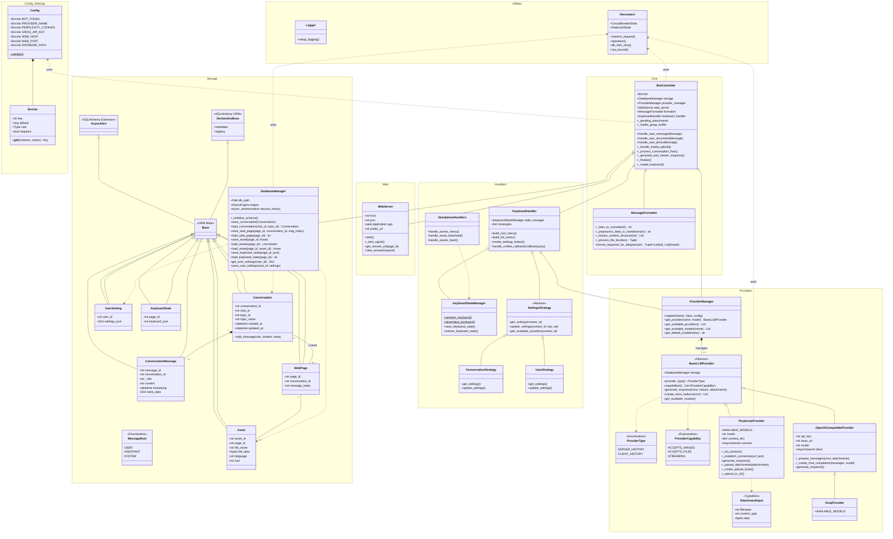

```mermaid
classDiagram
    %% ==========================================
    %% CONFIGURATION & SETTINGS
    %% ==========================================
    namespace Config_Settings {
        class EnvVar {
            +str key
            +Any default
            +Type cast
            +bool required
            +__get__(instance, owner) Any
        }
        
        class Config {
            +EnvVar BOT_TOKEN
            +EnvVar PROVIDER_NAME
            +EnvVar PERPLEXITY_COOKIES
            +EnvVar GROQ_API_KEY
            +EnvVar WEB_HOST
            +EnvVar WEB_PORT
            +EnvVar DATABASE_PATH
            +validate()$
        }
    }

    %% ==========================================
    %% DATABASE & MODELS
    %% ==========================================
    namespace Storage {
        %% External SQLAlchemy Parent Classes
        class AsyncAttrs {
            <<SQLAlchemy Extension>>
        }
        class DeclarativeBase {
            <<SQLAlchemy ORM>>
            +metadata
            +registry
        }

        class DatabaseManager {
            +Path db_path
            +AsyncEngine engine
            +async_sessionmaker session_factory
            +_initialize_schema()
            +save_conversation(Conversation)
            +load_conversation(chat_id, topic_id) Conversation
            +save_web_page(page_id, conversation_id, msg_index)
            +load_web_page(page_id) str
            +save_asset(page_id, Asset)
            +load_assets(page_id) List~Asset~
            +load_asset(page_id, asset_id) Asset
            +save_keyboard_state(page_id, json)
            +load_keyboard_state(page_id) str
            +get_user_settings(user_id) Dict
            +save_user_settings(user_id, settings)
        }

        %% The Base class acts as the anchor for the models
        class Base {
            <<ORM Base>>
        }

        class MessageRole {
            <<Enumeration>>
            USER
            ASSISTANT
            SYSTEM
        }

        class ConversationMessage {
            +int message_id
            +str conversation_id
            +str _role
            +str content
            +datetime timestamp
            +Dict meta_data
        }

        class Conversation {
            +str conversation_id
            +int chat_id
            +int topic_id
            +str topic_name
            +datetime created_at
            +datetime updated_at
            +add_message(role, content, meta)
        }

        class WebPage {
            +str page_id
            +str conversation_id
            +int message_index
        }

        class Asset {
            +str asset_id
            +str page_id
            +str file_name
            +bytes file_data
            +str language
            +int size
        }

        class UserSetting {
            +int user_id
            +Dict settings_json
        }

        class KeyboardState {
            +str page_id
            +str keyboard_json
        }
    }

    %% Inheritance Logic
    AsyncAttrs <|-- Base
    DeclarativeBase <|-- Base
    
    Base <|-- Conversation
    Base <|-- ConversationMessage
    Base <|-- WebPage
    Base <|-- Asset
    Base <|-- UserSetting
    Base <|-- KeyboardState

    %% ==========================================
    %% LLM PROVIDERS
    %% ==========================================
    namespace Providers {
        class ProviderType {
            <<Enumeration>>
            SERVER_HISTORY
            CLIENT_HISTORY
        }

        class ProviderCapability {
            <<Enumeration>>
            ACCEPTS_IMAGES
            ACCEPTS_FILES
            STREAMING
        }

        class AttachmentInput {
            <<TypedDict>>
            +str filename
            +str content_type
            +bytes data
        }

        class BaseLLMProvider {
            <<Abstract>>
            +DatabaseManager storage
            +provider_type() ProviderType*
            +capabilities() List~ProviderCapability~
            +generate_response(conv, stream, attachments)*
            +create_extra_buttons(conv) List
            +get_available_models()*
        }

        class OpenAICompatibleProvider {
            +str api_key
            +str base_url
            +str model
            +AsyncOpenAI client
            +_prepare_messages(conv, attachments)
            +_create_chat_completion(messages, model)
            +generate_response()
        }

        class GroqProvider {
            +AVAILABLE_MODELS
        }

        class PerplexityProvider {
            +AVAILABLE_MODELS
            +str model
            +dict cookies_dict
            +AsyncSession session
            +_init_session()
            +_establish_connection(url, json)
            +generate_response()
            +_upload_attachments(attachments)
            +_create_upload_ticket()
            +_upload_to_s3()
        }

        class ProviderManager {
            +register(name, class, config)
            +get_provider(name, model) BaseLLMProvider
            +get_available_providers() List
            +get_available_models(name) List
            +get_default_model(name) str
        }
    }

    %% ==========================================
    %% CORE LOGIC
    %% ==========================================
    namespace Core {
        class BotController {
            +Bot bot
            +DatabaseManager storage
            +ProviderManager provider_manager
            +WebServer web_server
            +MessageFormatter formatter
            +KeyboardHandler keyboard_handler
            +_pending_attachments
            +_media_group_buffer
            +handle_user_message(Message)
            +handle_user_document(Message)
            +handle_user_photo(Message)
            +_handle_media_upload()
            +_process_conversation_flow()
            +_generate_and_stream_response()
            +_finalize()
            +_create_keyboard()
        }

        class MessageFormatter {
            +_latex_to_unicode(str) str
            +_preprocess_latex_in_markdown(str) str
            +_extract_content_structure(str) List
            +_process_file_box(box) Tuple
            +format_response_for_telegram(str) Tuple~List[str], List[Asset]~
        }
    }

    %% ==========================================
    %% HANDLERS & UI
    %% ==========================================
    namespace Handlers {
        class KeyboardStateManager {
            +serialize_keyboard()$
            +deserialize_keyboard()$
            +save_keyboard_state()
            +restore_keyboard_state()
        }

        class SettingsStrategy {
            <<Abstract>>
            +get_settings(context_id)*
            +update_settings(context_id, key, val)*
            +get_available_providers(context_id)*
        }

        class ConversationStrategy {
            +get_settings()
            +update_settings()
        }

        class UserStrategy {
            +get_settings()
            +update_settings()
        }

        class KeyboardHandler {
            +KeyboardStateManager state_manager
            +Dict strategies
            +build_root_menu()
            +build_list_menu()
            +create_settings_button()
            +handle_unified_callback(CallbackQuery)
        }

        class StandaloneHandlers {
            +handle_assets_menu()
            +handle_asset_download()
            +handle_assets_back()
        }
    }

    %% ==========================================
    %% WEB SERVER
    %% ==========================================
    namespace Web {
        class WebServer {
            +str host
            +int port
            +web.Application app
            +str public_url
            +start()
            +_start_ngrok()
            +get_answer_url(page_id)
            +view_answer(request)
        }
    }

    %% ==========================================
    %% UTILS & DECORATORS
    %% ==========================================
    namespace Utilities {
        class Logger {
            +setup_logging()
        }

        class Decorators {
            +CircuitBreakerState
            +RateLimitState
            +resilient_request()
            +operation()
            +db_lock_retry()
            +cpu_bound()
        }
    }

    %% RELATIONSHIPS

    %% Config
    Config *-- EnvVar

    %% Models
    Base <|-- Conversation
    Base <|-- ConversationMessage
    Base <|-- WebPage
    Base <|-- Asset
    Base <|-- UserSetting
    Base <|-- KeyboardState
    Conversation "1" *-- "0..*" ConversationMessage
    Conversation "1" -- "0..*" WebPage : Linked
    WebPage "1" -- "0..*" Asset

    %% Storage
    DatabaseManager ..> Conversation
    DatabaseManager ..> Asset
    DatabaseManager ..> UserSetting

    %% Providers
    BaseLLMProvider <|-- OpenAICompatibleProvider
    BaseLLMProvider <|-- PerplexityProvider
    OpenAICompatibleProvider <|-- GroqProvider
    ProviderManager "1" *-- "0..*" BaseLLMProvider : manages
    PerplexityProvider ..> AttachmentInput
    BaseLLMProvider ..> ProviderType
    BaseLLMProvider ..> ProviderCapability

    %% Handlers
    SettingsStrategy <|-- ConversationStrategy
    SettingsStrategy <|-- UserStrategy
    KeyboardHandler o-- SettingsStrategy
    KeyboardHandler o-- KeyboardStateManager
    KeyboardHandler o-- ProviderManager
    StandaloneHandlers ..> KeyboardStateManager

    %% Core
    BotController o-- DatabaseManager
    BotController o-- ProviderManager
    BotController o-- WebServer
    BotController o-- MessageFormatter
    BotController o-- KeyboardHandler
    
    %% Main dependencies
    Config <.. BotController : uses
    Decorators <.. BotController : uses
    Decorators <.. DatabaseManager : uses
    Decorators <.. PerplexityProvider : uses
```
