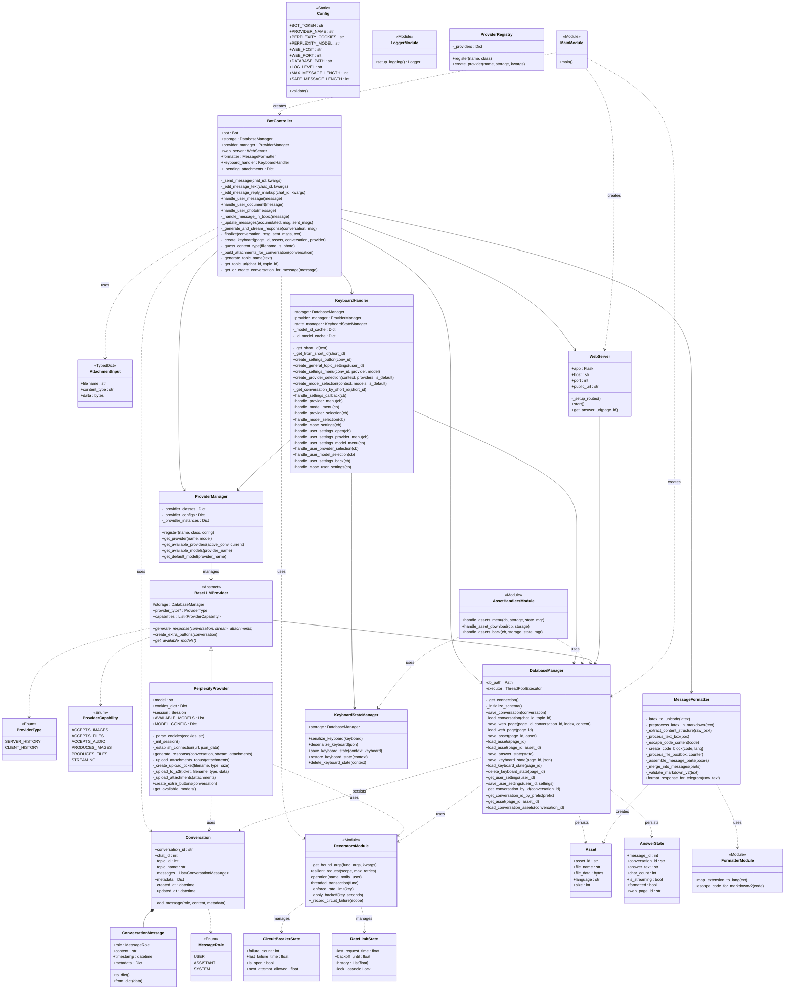

```mermaid
classDiagram
    %% ==========================================
    %% CORE CONFIGURATION & LOGGING
    %% ==========================================
    class Config {
        <<Static>>
        +BOT_TOKEN : str
        +PROVIDER_NAME : str
        +PERPLEXITY_COOKIES : str
        +PERPLEXITY_MODEL : str
        +WEB_HOST : str
        +WEB_PORT : int
        +DATABASE_PATH : str
        +LOG_LEVEL : str
        +MAX_MESSAGE_LENGTH : int
        +SAFE_MESSAGE_LENGTH : int
        +validate()
    }

    class LoggerModule {
        <<Module>>
        +setup_logging() Logger
    }

    %% ==========================================
    %% DECORATORS & RESILIENCE
    %% ==========================================
    class CircuitBreakerState {
        +failure_count : int
        +last_failure_time : float
        +is_open : bool
        +next_attempt_allowed : float
    }

    class RateLimitState {
        +last_request_time : float
        +backoff_until : float
        +history : List[float]
        +lock : asyncio.Lock
    }

    class DecoratorsModule {
        <<Module>>
        +_get_bound_args(func, args, kwargs)
        +resilient_request(scope, max_retries)
        +operation(name, notify_user)
        +threaded_transaction(func)
        +_enforce_rate_limit(key)
        +_apply_backoff(key, seconds)
        +_record_circuit_failure(scope)
    }

    %% ==========================================
    %% DATA MODELS (storage/models.py & base.py)
    %% ==========================================
    class MessageRole {
        <<Enum>>
        USER
        ASSISTANT
        SYSTEM
    }

    class ProviderType {
        <<Enum>>
        SERVER_HISTORY
        CLIENT_HISTORY
    }

    class ProviderCapability {
        <<Enum>>
        ACCEPTS_IMAGES
        ACCEPTS_FILES
        ACCEPTS_AUDIO
        PRODUCES_IMAGES
        PRODUCES_FILES
        STREAMING
    }

    class ConversationMessage {
        +role : MessageRole
        +content : str
        +timestamp : datetime
        +metadata : Dict
        +to_dict()
        +from_dict(data)
    }

    class Conversation {
        +conversation_id : str
        +chat_id : int
        +topic_id : int
        +topic_name : str
        +messages : List~ConversationMessage~
        +metadata : Dict
        +created_at : datetime
        +updated_at : datetime
        +add_message(role, content, metadata)
    }

    class Asset {
        +asset_id : str
        +file_name : str
        +file_data : bytes
        +language : str
        +size : int
    }

    class AnswerState {
        +message_id : int
        +conversation_id : str
        +answer_text : str
        +char_count : int
        +is_streaming : bool
        +formatted : bool
        +web_page_id : str
    }

    class AttachmentInput {
        <<TypedDict>>
        +filename : str
        +content_type : str
        +data : bytes
    }

    %% ==========================================
    %% STORAGE LAYER
    %% ==========================================
    class DatabaseManager {
        -db_path : Path
        -executor : ThreadPoolExecutor
        -_get_connection()
        -_initialize_schema()
        +save_conversation(conversation)
        +load_conversation(chat_id, topic_id)
        +save_web_page(page_id, conversation_id, index, content)
        +load_web_page(page_id)
        +save_asset(page_id, asset)
        +load_assets(page_id)
        +load_asset(page_id, asset_id)
        +save_answer_state(state)
        +save_keyboard_state(page_id, json)
        +load_keyboard_state(page_id)
        +delete_keyboard_state(page_id)
        +get_user_settings(user_id)
        +save_user_settings(user_id, settings)
        +get_conversation_by_id(conversation_id)
        +get_conversation_id_by_prefix(prefix)
        +get_asset(page_id, asset_id)
        +load_conversation_assets(conversation_id)
    }

    %% ==========================================
    %% PROVIDER LOGIC
    %% ==========================================
    class ProviderManager {
        -_provider_classes : Dict
        -_provider_configs : Dict
        -_provider_instances : Dict
        +register(name, class, config)
        +get_provider(name, model)
        +get_available_providers(active_conv, current)
        +get_available_models(provider_name)
        +get_default_model(provider_name)
    }

    class ProviderRegistry {
        -_providers : Dict
        +register(name, class)
        +create_provider(name, storage, kwargs)
    }

    class BaseLLMProvider {
        <<Abstract>>
        #storage : DatabaseManager
        +provider_type* : ProviderType
        +capabilities : List~ProviderCapability~
        +generate_response(conversation, stream, attachments)*
        +create_extra_buttons(conversation)
        +get_available_models()*
    }

    class PerplexityProvider {
        +model : str
        +cookies_dict : Dict
        +session : Session
        +AVAILABLE_MODELS : List
        +MODEL_CONFIG : Dict
        -_parse_cookies(cookies_str)
        -_init_session()
        -_establish_connection(url, json_data)
        +generate_response(conversation, stream, attachments)
        -_upload_attachments_robust(attachments)
        -_create_upload_ticket(filename, type, size)
        -_upload_to_s3(ticket, filename, type, data)
        -_upload_attachments(attachments)
        +create_extra_buttons(conversation)
        +get_available_models()
    }

    %% ==========================================
    %% FORMATTING & WEB
    %% ==========================================
    class FormatterModule {
        <<Module>>
        +map_extension_to_lang(ext)
        +escape_code_for_markdownv2(code)
    }

    class MessageFormatter {
        -_latex_to_unicode(latex)
        -_preprocess_latex_in_markdown(text)
        -_extract_content_structure(raw_text)
        -_process_text_box(box)
        -_escape_code_content(code)
        -_create_code_block(code, lang)
        -_process_file_box(box, counter)
        -_assemble_message_parts(boxes)
        -_merge_into_messages(parts)
        -_validate_markdown_v2(text)
        +format_response_for_telegram(raw_text)
    }

    class WebServer {
        +app : Flask
        +host : str
        +port : int
        +public_url : str
        -_setup_routes()
        +start()
        +get_answer_url(page_id)
    }

    %% ==========================================
    %% BOT CONTROLLER & HANDLERS
    %% ==========================================
    class BotController {
        +bot : Bot
        +storage : DatabaseManager
        +provider_manager : ProviderManager
        +web_server : WebServer
        +formatter : MessageFormatter
        +keyboard_handler : KeyboardHandler
        +_pending_attachments : Dict
        -_send_message(chat_id, kwargs)
        -_edit_message_text(chat_id, kwargs)
        -_edit_message_reply_markup(chat_id, kwargs)
        +handle_user_message(message)
        +handle_user_document(message)
        +handle_user_photo(message)
        -_handle_message_in_topic(message)
        -_update_messages(accumulated, msg, sent_msgs)
        -_generate_and_stream_response(conversation, msg)
        -_finalize(conversation, msg, sent_msgs, text)
        -_create_keyboard(page_id, assets, conversation, provider)
        -_guess_content_type(filename, is_photo)
        -_build_attachments_for_conversation(conversation)
        -_generate_topic_name(text)
        -_get_topic_url(chat_id, topic_id)
        -_get_or_create_conversation_for_message(message)
    }

    class KeyboardStateManager {
        +storage : DatabaseManager
        +serialize_keyboard(keyboard)
        +deserialize_keyboard(json)
        +save_keyboard_state(context, keyboard)
        +restore_keyboard_state(context)
        +delete_keyboard_state(context)
    }

    class KeyboardHandler {
        +storage : DatabaseManager
        +provider_manager : ProviderManager
        +state_manager : KeyboardStateManager
        -_model_id_cache : Dict
        -_id_model_cache : Dict
        -_get_short_id(text)
        -_get_from_short_id(short_id)
        +create_settings_button(conv_id)
        +create_general_topic_settings(user_id)
        +create_settings_menu(conv_id, provider, model)
        +create_provider_selection(context, providers, is_default)
        +create_model_selection(context, models, is_default)
        -_get_conversation_by_short_id(short_id)
        +handle_settings_callback(cb)
        +handle_provider_menu(cb)
        +handle_model_menu(cb)
        +handle_provider_selection(cb)
        +handle_model_selection(cb)
        +handle_close_settings(cb)
        +handle_user_settings_open(cb)
        +handle_user_settings_provider_menu(cb)
        +handle_user_settings_model_menu(cb)
        +handle_user_provider_selection(cb)
        +handle_user_model_selection(cb)
        +handle_user_settings_back(cb)
        +handle_close_user_settings(cb)
    }

    class AssetHandlersModule {
        <<Module>>
        +handle_assets_menu(cb, storage, state_mgr)
        +handle_asset_download(cb, storage)
        +handle_assets_back(cb, storage, state_mgr)
    }

    class MainModule {
        <<Module>>
        +main()
    }

    %% ==========================================
    %% RELATIONSHIPS
    %% ==========================================
    
    %% Controller Dependencies
    BotController --> DatabaseManager
    BotController --> ProviderManager
    BotController --> WebServer
    BotController --> MessageFormatter
    BotController --> KeyboardHandler
    BotController ..> Conversation : uses
    BotController ..> AttachmentInput : uses
    BotController ..> DecoratorsModule : uses

    %% Handler Dependencies
    KeyboardHandler --> DatabaseManager
    KeyboardHandler --> ProviderManager
    KeyboardHandler --> KeyboardStateManager
    AssetHandlersModule ..> DatabaseManager : uses
    AssetHandlersModule ..> KeyboardStateManager : uses

    %% Provider Dependencies
    ProviderManager --> BaseLLMProvider : manages
    BaseLLMProvider <|-- PerplexityProvider
    BaseLLMProvider --> DatabaseManager
    PerplexityProvider ..> DecoratorsModule : uses
    PerplexityProvider ..> Conversation : uses
    
    %% Storage Dependencies
    DatabaseManager ..> Conversation : persists
    DatabaseManager ..> Asset : persists
    DatabaseManager ..> AnswerState : persists
    DatabaseManager ..> DecoratorsModule : uses

    %% Data Model Composition
    Conversation *-- ConversationMessage
    Conversation ..> MessageRole
    BaseLLMProvider ..> ProviderType
    BaseLLMProvider ..> ProviderCapability

    %% Utility Dependencies
    DecoratorsModule ..> CircuitBreakerState : manages
    DecoratorsModule ..> RateLimitState : manages
    MessageFormatter ..> Asset : creates
    MessageFormatter ..> FormatterModule : uses
    WebServer --> DatabaseManager

    %% Main Entry Point
    MainModule ..> BotController : creates
    MainModule ..> DatabaseManager : creates
    MainModule ..> WebServer : creates
```
