# Advanced LLM Telegram Bot

A feature-rich, asynchronous Telegram bot that acts as a unified interface for multiple Large Language Model providers. Currently supports **Perplexity AI** (web search, reasoning) and **Groq** (high-speed inference).

This bot goes beyond simple text echoing by offering rich Markdown formatting, LaTeX rendering, file attachments, thread support, and a dedicated Web View for complex responses.

## Features

*   **Multi-Provider Support**: Switch dynamically between **Perplexity** and **Groq** for now, the list can be expanded.
*   **Streaming Responses**: Real-time token streaming for a responsive user experience.
*   **Rich Formatting**:
    *   Auto-converts Markdown to Telegram-compatible formats.
    *   Renders LaTeX equations (e.g., $\sqrt{x}$) into Unicode approximations for chat.
    *   Syntax highlighting for code blocks.
*   **Web View & Artifacts**:
    *   Generates a "Web View" link for responses containing complex Math/LaTeX or long formatting.
    *   **Asset Extraction**: Automatically detects code blocks and files in LLM responses and offers them as downloadable files within Telegram.
*   **Context Awareness**:
    *   Supports Telegram Forum Topics (Threads).
    *   Maintains conversation history in a SQLite database.
    *   Allows changing models/providers per-thread or globally per-user.
*   **Media Support**:
    *   Send images (Vision capabilities).
    *   Send text/code files for analysis.
*   **Robust Architecture**:
    *   Async database operations (SQLAlchemy + aiosqlite).
    *   Circuit breakers and retry logic for API stability.
    *   Integrated Web Server (aiohttp) with automatic Ngrok tunneling.

## Prerequisites

*   Python 3.9+
*   A Telegram Bot Token (from @BotFather)
*   (Optional) A Groq API Key
*   (Optional) Perplexity Account Cookies (for Perplexity provider)
*   (Optional) Ngrok Auth Token (for public Web View)

## Installation

1.  **Clone the repository:**
    ```bash
    git clone https://github.com/yourusername/llm-telegram-bot.git
    cd llm-telegram-bot
    ```

2.  **Create a virtual environment:**
    ```bash
    python -m venv venv
    source venv/bin/activate
    ```

3.  **Install dependencies:**
    ```bash
    pip install -r requirements.txt
    ```

## Configuration

Create a `.env` file in the root directory (see `.env.example`).

### How to get Perplexity Cookies
To access Perplexity provider, you need your session cookies. The easiest way is using the **Cookie-Editor** browser extension:

1.  Install **Cookie-Editor** for [Chrome](https://chromewebstore.google.com/detail/cookie-editor/hlkenndednhfkekhgcdicdfddnkalmdm) or [Firefox](https://addons.mozilla.org/en-US/firefox/addon/cookie-editor/).
2.  Log in to [perplexity.ai](https://www.perplexity.ai).
3.  Open the extension and click the **Export** button (bottom right).
4.  Select **Header String**.
5.  Paste the copied string into your `.env` file as `PERPLEXITY_COOKIES`.

## Usage

This bot is designed to work best in **Telegram Groups with Topics enabled**. This allows each conversation to have its own dedicated history and settings.

### 1. Group Setup
1.  **Create a new Group** in Telegram.
2.  Open the group info and click **Edit** (pencil icon).
3.  Find **Topics** and enable it.
4.  **Pin** the "General" topic so it stays at the top (recommended).

### 2. Bot Permissions
1.  Add the bot to the group.
2.  Promote the bot to **Admin** (Group Info > Administrators > Add Admin).
3.  *Crucial Step*: In the Admin rights menu, ensure **Manage Topics** is enabled.
    *   *Note*: The Telegram disables this option after the adding admin, save the admin rights first, then tap on the bot in the list of admins again to edit permissions and toggle **Manage Topics** on.

### 3. Starting a Conversation
1.  Go to the **General** topic.
2.  Send your prompt (e.g., "Help me write a Python script").
3.  The bot will automatically:
    *   Create a **New Topic** derived from your prompt.
    *   Reply inside that new topic.
    *   Save the conversation history specifically for that thread.

## Project Structure

```
.
├── main.py                  # Entry point
├── requirements.txt         # Dependencies
├── mypy.ini                 # Type checking config
├── config/
│   ├── logger.py            # Logging configuration
│   └── settings.py          # Environment variables & Config class
├── core/
│   ├── bot_controller.py    # Core Telegram logic
│   └── handlers.py          # Callback/Button handlers
├── decorators/
│   └── decorators.py        # Resilience & utility decorators
├── providers/
│   ├── base.py              # Abstract base class for providers
│   ├── groq.py              # Groq Provider
│   ├── openai_compatible.py # Generic OpenAI wrapper
│   ├── perplexity.py        # Perplexity Provider (Internal API)
│   └── provider_manager.py  # Dynamic provider switching logic
├── storage/
│   ├── database.py          # Async Database Manager
│   └── models.py            # SQLAlchemy Database Models
├── utils/
│   ├── formatter.py         # Markdown & LaTeX processing
│   └── webserver.py         # AIOHTTP server for Web View
└── var/                     # Database storage location
```

## Architecture

The bot uses a modular architecture separating the Telegram Interface, LLM Providers, and Data Storage.

```mermaid
classDiagram
    namespace Configuration {
        class EnvVar {
            +str key
            +Any default
            +Type cast
            +bool required
            -Any _value
            -bool _loaded
            +__init__(key, default, cast, required)
            +__get__(instance, owner)
        }

        class Config {
            +EnvVar BOT_TOKEN
            +EnvVar PROVIDER_NAME
            +EnvVar PERPLEXITY_COOKIES
            +EnvVar PERPLEXITY_MODEL
            +EnvVar GROQ_API_KEY
            +EnvVar GROQ_MODEL
            +EnvVar WEB_HOST
            +EnvVar WEB_PORT
            +EnvVar NGROK_AUTH_TOKEN
            +EnvVar NGROK_DOMAIN
            +EnvVar DATABASE_PATH
            +EnvVar LOG_LEVEL
            +EnvVar MAX_MESSAGE_LENGTH
            +EnvVar SAFE_MESSAGE_LENGTH
            +EnvVar MIN_UPDATE_INTERVAL
            +EnvVar MAX_UPDATE_INTERVAL
            +EnvVar INITIAL_RETRY_DELAY
            +EnvVar MAX_RETRY_DELAY
            +EnvVar MAX_RETRIES
            +validate()$
        }

        class Logger {
            +setup_logging()
        }
    }

    namespace DataModels {
        class MessageRole {
            <<Enumeration>>
            USER
            ASSISTANT
            SYSTEM
        }

        class ProviderType {
            <<Enumeration>>
            SERVER_HISTORY
            CLIENT_HISTORY
        }

        class ProviderCapability {
            <<Enumeration>>
            ACCEPTS_IMAGES
            ACCEPTS_FILES
            STREAMING
        }

        class Base {
            <<SQLAlchemy>>
        }

        class ConversationMessage {
            +int message_id
            +str conversation_id
            +str _role
            +str content
            +datetime timestamp
            +Dict meta_data_json
            +role
            +meta_data
            +__init__(role, content, timestamp, meta_data)
        }

        class Conversation {
            +str conversation_id
            +int chat_id
            +int topic_id
            +str topic_name
            +Dict meta_data_json
            +datetime created_at
            +datetime updated_at
            +List~ConversationMessage~ messages
            +meta_data
            +add_message(role, content, meta_data)
            +__init__(conversation_id, chat_id, topic_id, topic_name, meta_data)
        }

        class WebPage {
            +str page_id
            +str conversation_id
            +int message_index
            +datetime created_at
        }

        class Asset {
            +str asset_id
            +str page_id
            +str file_name
            +bytes file_data
            +str language
            +int size
            +datetime created_at
            +__init__(asset_id, file_name, file_data, language, size)
        }

        class UserSetting {
            +int user_id
            +Dict settings_json
            +datetime updated_at
        }

        class KeyboardState {
            +str page_id
            +str keyboard_json
            +datetime created_at
        }
    }

    namespace Storage {
        class DatabaseManager {
            +Path db_path
            +AsyncEngine engine
            +async_sessionmaker session_factory
            +__init__(db_path)
            -_initialize_schema()
            +save_conversation(conversation)
            +load_conversation(chat_id, topic_id)
            +save_web_page(page_id, conversation_id, message_index)
            +load_web_page(page_id)
            +save_asset(page_id, asset)
            +load_assets(page_id)
            +load_asset(page_id, asset_id)
            +save_keyboard_state(page_id, keyboard_json)
            +load_keyboard_state(page_id)
            +delete_keyboard_state(page_id)
            +get_user_settings(user_id)
            +save_user_settings(user_id, settings)
            +get_conversation_by_id(conversation_id)
            +get_conversation_id_by_prefix(prefix)
        }
    }

    namespace Utils {
        class Decorators {
            <<Utility>>
            +resilient_request(scope, max_retries, use_circuit_breaker)
            +operation(name, notify_user, validate_callback_prefix)
            +db_lock_retry(func)
            +cpu_bound(func)
        }

        class CircuitBreakerState {
            +int failure_count
            +float last_failure_time
            +bool is_open
            +float next_attempt_allowed
        }

        class RateLimitState {
            +float last_request_time
            +float backoff_until
            +List~float~ history
            +Lock lock
        }

        class WebServer {
            +str HTML_TEMPLATE
            +DatabaseManager storage
            +str host
            +int port
            +Application app
            +AppRunner runner
            +str public_url
            +Template template
            +__init__(storage, host, port)
            -_setup_routes()
            +view_answer(request)
            +start()
            -_start_ngrok()
            +get_answer_url(page_id)
            +stop()
        }

        class MessageFormatter {
            +__init__()
            -_latex_to_unicode(latex)
            -_preprocess_latex_in_markdown(text)
            -_extract_content_structure(raw_text)
            -_process_text_box(box)
            -_escape_code_content(code)
            -_create_code_block(code, lang)
            -_process_file_box(box, file_type_counter)
            -_assemble_message_parts(boxes)
            -_merge_into_messages(string_parts)
            -_validate_markdown_v2(text)
            +format_response_for_telegram(raw_text)
        }
    }

    namespace AI_Providers {
        class AttachmentInput {
            <<TypedDict>>
            +str filename
            +str content_type
            +bytes data
        }

        class LLMProvider {
            <<Protocol>>
            +provider_type
            +capabilities
            +generate_response(conversation, stream, attachments)
            +create_extra_buttons(conversation)
            +get_available_models()
        }

        class BaseLLMProvider {
            <<Abstract>>
            +DatabaseManager storage
            +__init__(storage)
            +provider_type*
            +capabilities
            +generate_response(conversation, stream, attachments)*
            +create_extra_buttons(conversation)
            +get_available_models()*
        }

        class ProviderManager {
            +DatabaseManager storage
            -_provider_classes
            -_provider_configs
            -_provider_instances
            +__init__(storage)
            +register(name, provider_class, config)
            +get_provider(name, model)
            +get_available_providers(in_active_conversation, current_provider)
            +get_available_models(provider_name)
            +get_default_model(provider_name)
        }

        class PerplexityProvider {
            +List AVAILABLE_MODELS
            +Dict MODEL_CONFIG
            +str model
            +Dict cookies_dict
            +AsyncSession session
            +__init__(storage, cookies, model)
            +provider_type
            +capabilities
            +get_available_models()
            -_parse_cookies(cookies_str)
            -_init_session()
            -_establish_connection(url, json_data)
            +generate_response(conversation, stream, attachments)
            -_upload_attachments(attachments)
            -_create_upload_ticket(filename, content_type, file_size)
            -_upload_to_s3(ticket, filename, content_type, data)
            +create_extra_buttons(conversation)
        }

        class OpenAICompatibleProvider {
            +str api_key
            +str base_url
            +str model
            +str default_system_prompt
            +AsyncOpenAI client
            +__init__(storage, api_key, base_url, model, default_system_prompt)
            +provider_type
            +capabilities
            +get_available_models()
            -_encode_image(image_data)
            -_prepare_messages(conversation, attachments)
            -_create_chat_completion(messages, model)
            +generate_response(conversation, stream, attachments)
        }

        class GroqProvider {
            +List AVAILABLE_MODELS
            +__init__(storage, api_key, model)
            +get_available_models()
        }
    }

    namespace Interaction {
        class BotController {
            +Bot bot
            +DatabaseManager storage
            +ProviderManager provider_manager
            +WebServer web_server
            +MessageFormatter formatter
            +KeyboardHandler keyboard_handler
            -_pending_attachments
            -_media_group_buffer
            +__init__(bot, storage, provider_manager, web_server, formatter)
            -_send_message(chat_id, kwargs)
            -_edit_message_text(chat_id, kwargs)
            -_edit_message_reply_markup(chat_id, kwargs)
            +handle_user_message(message)
            +handle_user_document(message)
            +handle_user_photo(message)
            -_handle_media_upload(message, is_photo)
            -_download_file(message, is_photo)
            -_buffer_media_group(message, attachment)
            -_media_group_timer(mg_id)
            -_finalize_media_group(mg_id)
            -_process_conversation_flow(message, text, immediate_attachments)
            -_generate_and_stream_response(conversation, thinking_msg, attachments)
            -_update_messages(accumulated_text, thinking_msg, sent_messages)
            -_finalize(conversation, first_message, sent_messages, full_text)
            -_create_keyboard(page_id, assets, conversation, provider)
            -_guess_content_type(filename)
            -_generate_topic_name(text)
            -_get_topic_url(chat_id, topic_id)
            -_get_or_create_conversation_for_message(message)
        }

        class KeyboardStateManager {
            +DatabaseManager storage
            +__init__(storage)
            +serialize_keyboard(keyboard)$
            +deserialize_keyboard(keyboard_json)$
            +save_keyboard_state(context_id, keyboard)
            +restore_keyboard_state(context_id)
            +delete_keyboard_state(context_id)
        }

        class SettingsStrategy {
            <<Abstract>>
            +DatabaseManager storage
            +ProviderManager provider_manager
            +__init__(storage, provider_manager)
            +get_settings(context_id)*
            +update_settings(context_id, key, value)*
            +get_available_providers(context_id)*
        }

        class ConversationStrategy {
            +get_settings(context_id)
            +update_settings(context_id, key, value)
            +get_available_providers(context_id)
        }

        class UserStrategy {
            +get_settings(context_id)
            +update_settings(context_id, key, value)
            +get_available_providers(context_id)
        }

        class KeyboardHandler {
            +DatabaseManager storage
            +ProviderManager provider_manager
            +KeyboardStateManager state_manager
            +Dict strategies
            +__init__(storage, provider_manager)
            -_hash_val(text)
            -_resolve_val(hashed, candidates)
            -_resolve_context_id(scope, short_id)
            +build_root_menu(scope, short_id, settings)
            +build_list_menu(scope, short_id, items, category)
            +create_settings_button(conversation_id)
            +handle_unified_callback(callback)
        }
        
        class HandlerFunctions {
            <<Standalone>>
            +handle_assets_menu(callback, storage, state_manager)
            +handle_asset_download(callback, storage)
            +handle_assets_back(callback, storage, state_manager)
        }
    }

    %% Relationships
    Config *-- EnvVar
    Conversation "1" *-- "*" ConversationMessage : contains
    Conversation "1" o-- "1" WebPage : has
    WebPage "1" *-- "*" Asset : contains
    Base <|-- ConversationMessage
    Base <|-- Conversation
    Base <|-- WebPage
    Base <|-- Asset
    Base <|-- UserSetting
    Base <|-- KeyboardState

    BotController --> DatabaseManager
    BotController --> ProviderManager
    BotController --> WebServer
    BotController --> MessageFormatter
    BotController --> KeyboardHandler
    BotController ..> Conversation
    BotController ..> AttachmentInput

    ProviderManager o-- BaseLLMProvider
    LLMProvider <|.. BaseLLMProvider
    BaseLLMProvider <|-- PerplexityProvider
    BaseLLMProvider <|-- OpenAICompatibleProvider
    OpenAICompatibleProvider <|-- GroqProvider
    BaseLLMProvider --> DatabaseManager
    PerplexityProvider ..> AttachmentInput

    KeyboardHandler --> KeyboardStateManager
    KeyboardHandler o-- SettingsStrategy
    SettingsStrategy <|-- ConversationStrategy
    SettingsStrategy <|-- UserStrategy
    SettingsStrategy --> DatabaseManager
    SettingsStrategy --> ProviderManager

    WebServer --> DatabaseManager
    
    HandlerFunctions ..> DatabaseManager
    HandlerFunctions ..> KeyboardStateManager
```



## License

MIT License.
