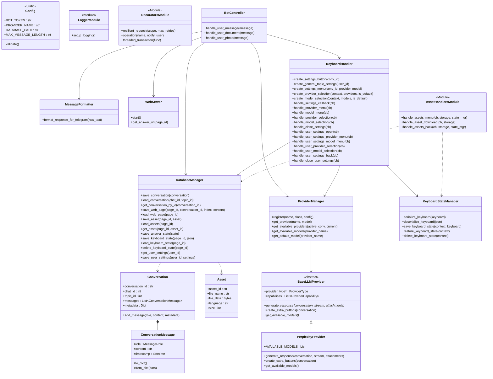

```mermaid
classDiagram
    %% ==========================================
    %% CONFIGURATION & UTILS
    %% ==========================================
    class Config {
        <<Static>>
        +BOT_TOKEN : str
        +PROVIDER_NAME : str
        +DATABASE_PATH : str
        +MAX_MESSAGE_LENGTH : int
        +validate()
    }

    class LoggerModule {
        <<Module>>
        +setup_logging()
    }

    class DecoratorsModule {
        <<Module>>
        +resilient_request(scope, max_retries)
        +operation(name, notify_user)
        +threaded_transaction(func)
    }

    %% ==========================================
    %% DATA MODELS
    %% ==========================================
    class Conversation {
        +conversation_id : str
        +chat_id : int
        +topic_id : int
        +messages : List~ConversationMessage~
        +metadata : Dict
        +add_message(role, content, metadata)
    }

    class ConversationMessage {
        +role : MessageRole
        +content : str
        +timestamp : datetime
        +to_dict()
        +from_dict(data)
    }

    class Asset {
        +asset_id : str
        +file_name : str
        +file_data : bytes
        +language : str
        +size : int
    }

    %% ==========================================
    %% STORAGE LAYER
    %% ==========================================
    class DatabaseManager {
        +save_conversation(conversation)
        +load_conversation(chat_id, topic_id)
        +get_conversation_by_id(conversation_id)
        +save_web_page(page_id, conversation_id, index, content)
        +load_web_page(page_id)
        +save_asset(page_id, asset)
        +load_assets(page_id)
        +get_asset(page_id, asset_id)
        +save_answer_state(state)
        +save_keyboard_state(page_id, json)
        +load_keyboard_state(page_id)
        +delete_keyboard_state(page_id)
        +get_user_settings(user_id)
        +save_user_settings(user_id, settings)
    }

    %% ==========================================
    %% PROVIDER LOGIC
    %% ==========================================
    class ProviderManager {
        +register(name, class, config)
        +get_provider(name, model)
        +get_available_providers(active_conv, current)
        +get_available_models(provider_name)
        +get_default_model(provider_name)
    }

    class BaseLLMProvider {
        <<Abstract>>
        +provider_type* : ProviderType
        +capabilities : List~ProviderCapability~
        +generate_response(conversation, stream, attachments)*
        +create_extra_buttons(conversation)
        +get_available_models()*
    }

    class PerplexityProvider {
        +AVAILABLE_MODELS : List
        +generate_response(conversation, stream, attachments)
        +create_extra_buttons(conversation)
        +get_available_models()
    }

    %% ==========================================
    %% FORMATTING & WEB
    %% ==========================================
    class MessageFormatter {
        +format_response_for_telegram(raw_text)
    }

    class WebServer {
        +start()
        +get_answer_url(page_id)
    }

    %% ==========================================
    %% BOT CONTROLLER & HANDLERS
    %% ==========================================
    class BotController {
        +handle_user_message(message)
        +handle_user_document(message)
        +handle_user_photo(message)
    }

    class KeyboardStateManager {
        +serialize_keyboard(keyboard)
        +deserialize_keyboard(json)
        +save_keyboard_state(context, keyboard)
        +restore_keyboard_state(context)
        +delete_keyboard_state(context)
    }

    class KeyboardHandler {
        +create_settings_button(conv_id)
        +create_general_topic_settings(user_id)
        +create_settings_menu(conv_id, provider, model)
        +create_provider_selection(context, providers, is_default)
        +create_model_selection(context, models, is_default)
        +handle_settings_callback(cb)
        +handle_provider_menu(cb)
        +handle_model_menu(cb)
        +handle_provider_selection(cb)
        +handle_model_selection(cb)
        +handle_close_settings(cb)
        +handle_user_settings_open(cb)
        +handle_user_settings_provider_menu(cb)
        +handle_user_settings_model_menu(cb)
        +handle_user_provider_selection(cb)
        +handle_user_model_selection(cb)
        +handle_user_settings_back(cb)
        +handle_close_user_settings(cb)
    }

    class AssetHandlersModule {
        <<Module>>
        +handle_assets_menu(cb, storage, state_mgr)
        +handle_asset_download(cb, storage)
        +handle_assets_back(cb, storage, state_mgr)
    }

    %% ==========================================
    %% RELATIONSHIPS
    %% ==========================================
    
    BotController --> DatabaseManager
    BotController --> ProviderManager
    BotController --> WebServer
    BotController --> MessageFormatter
    BotController --> KeyboardHandler
    
    KeyboardHandler --> DatabaseManager
    KeyboardHandler --> ProviderManager
    KeyboardHandler --> KeyboardStateManager
    
    AssetHandlersModule ..> DatabaseManager
    AssetHandlersModule ..> KeyboardStateManager

    ProviderManager --> BaseLLMProvider
    BaseLLMProvider <|-- PerplexityProvider
    
    Conversation *-- ConversationMessage
    DatabaseManager ..> Conversation
    DatabaseManager ..> Asset
```
