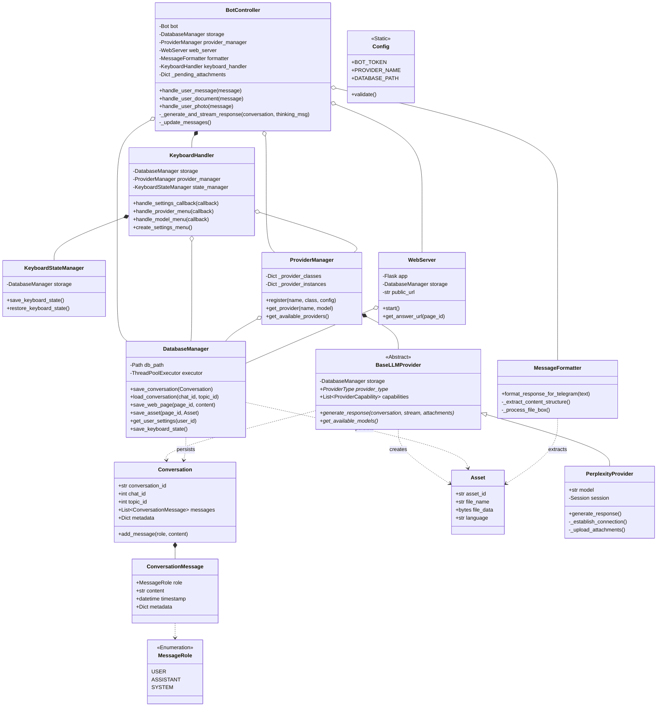

```mermaid
classDiagram
    %% Core Logic
    class BotController {
        -Bot bot
        -DatabaseManager storage
        -ProviderManager provider_manager
        -WebServer web_server
        -MessageFormatter formatter
        -KeyboardHandler keyboard_handler
        -Dict _pending_attachments
        +handle_user_message(message)
        +handle_user_document(message)
        +handle_user_photo(message)
        -_generate_and_stream_response(conversation, thinking_msg)
        -_update_messages()
    }

    class KeyboardHandler {
        -DatabaseManager storage
        -ProviderManager provider_manager
        -KeyboardStateManager state_manager
        +handle_settings_callback(callback)
        +handle_provider_menu(callback)
        +handle_model_menu(callback)
        +create_settings_menu()
    }

    class KeyboardStateManager {
        -DatabaseManager storage
        +save_keyboard_state()
        +restore_keyboard_state()
    }

    %% Storage & Models
    class DatabaseManager {
        -Path db_path
        -ThreadPoolExecutor executor
        +save_conversation(Conversation)
        +load_conversation(chat_id, topic_id)
        +save_web_page(page_id, content)
        +save_asset(page_id, Asset)
        +get_user_settings(user_id)
        +save_keyboard_state()
    }

    class Conversation {
        +str conversation_id
        +int chat_id
        +int topic_id
        +List~ConversationMessage~ messages
        +Dict metadata
        +add_message(role, content)
    }

    class ConversationMessage {
        +MessageRole role
        +str content
        +datetime timestamp
        +Dict metadata
    }

    class Asset {
        +str asset_id
        +str file_name
        +bytes file_data
        +str language
    }

    class MessageRole {
        <<Enumeration>>
        USER
        ASSISTANT
        SYSTEM
    }

    %% Providers
    class ProviderManager {
        -Dict _provider_classes
        -Dict _provider_instances
        +register(name, class, config)
        +get_provider(name, model)
        +get_available_providers()
    }

    class BaseLLMProvider {
        <<Abstract>>
        -DatabaseManager storage
        +ProviderType provider_type*
        +List~ProviderCapability~ capabilities
        +generate_response(conversation, stream, attachments)*
        +get_available_models()*
    }

    class PerplexityProvider {
        +str model
        -Session session
        +generate_response()
        -_establish_connection()
        -_upload_attachments()
    }

    %% Utilities
    class WebServer {
        -Flask app
        -DatabaseManager storage
        -str public_url
        +start()
        +get_answer_url(page_id)
    }

    class MessageFormatter {
        +format_response_for_telegram(text)
        -_extract_content_structure()
        -_process_file_box()
    }

    class Config {
        <<Static>>
        +BOT_TOKEN
        +PROVIDER_NAME
        +DATABASE_PATH
        +validate()
    }

    %% Relationships
    BotController o-- DatabaseManager
    BotController o-- ProviderManager
    BotController o-- WebServer
    BotController o-- MessageFormatter
    BotController *-- KeyboardHandler

    KeyboardHandler o-- DatabaseManager
    KeyboardHandler o-- ProviderManager
    KeyboardHandler *-- KeyboardStateManager

    ProviderManager o-- DatabaseManager
    ProviderManager *-- BaseLLMProvider

    BaseLLMProvider <|-- PerplexityProvider
    BaseLLMProvider ..> Conversation : uses
    BaseLLMProvider ..> Asset : creates

    DatabaseManager ..> Conversation : persists
    DatabaseManager ..> Asset : persists
    
    Conversation *-- ConversationMessage
    ConversationMessage ..> MessageRole

    WebServer o-- DatabaseManager
    
    MessageFormatter ..> Asset : extracts
```
